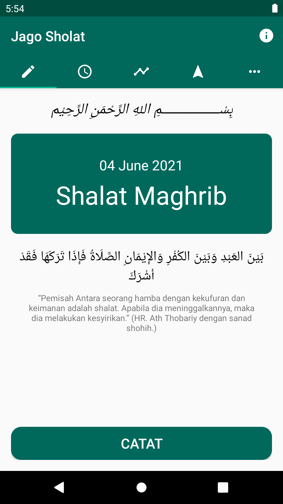
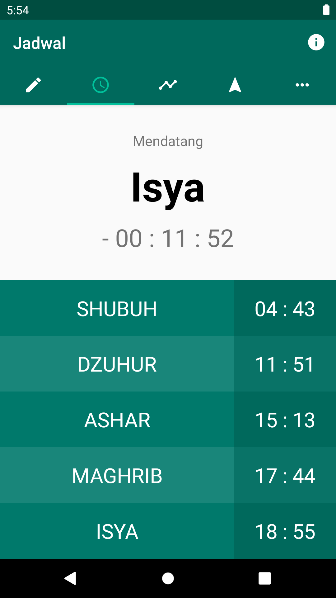
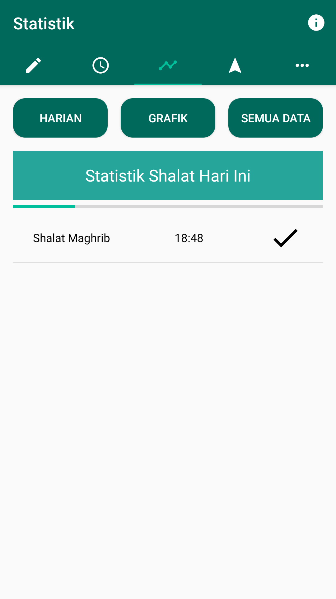
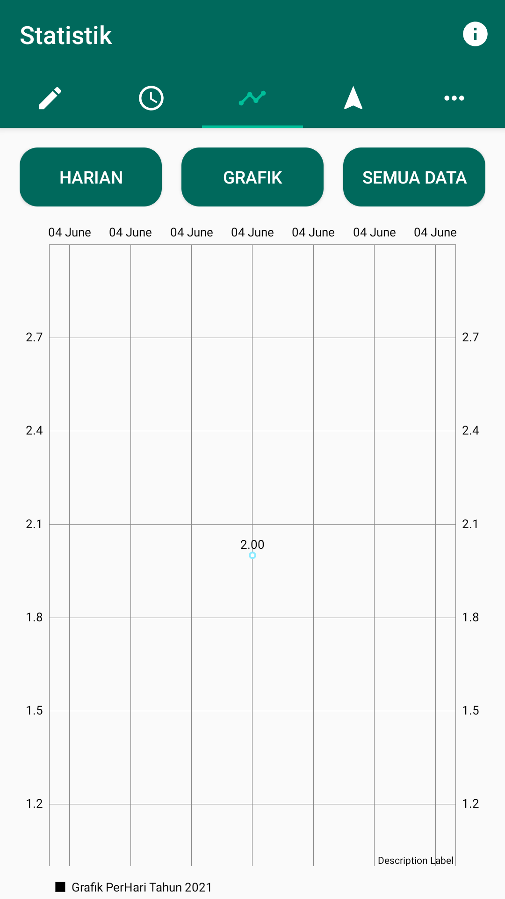
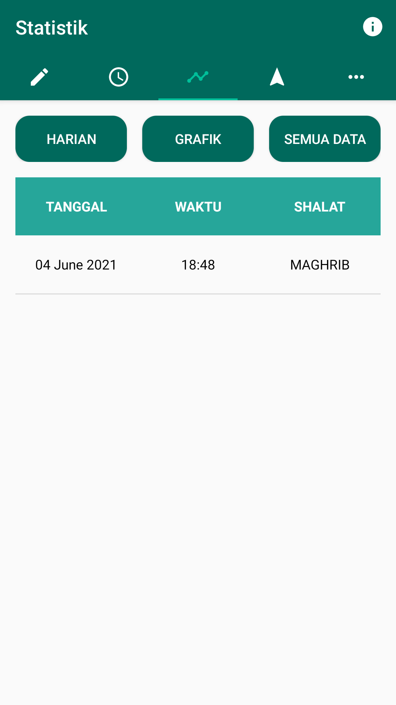
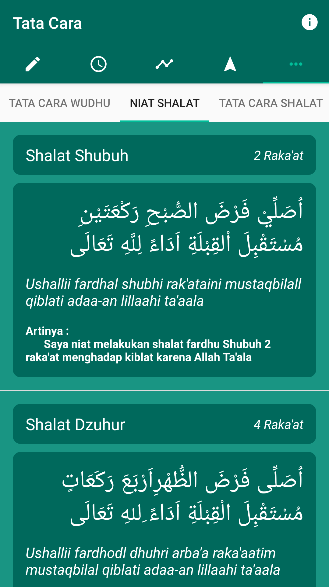
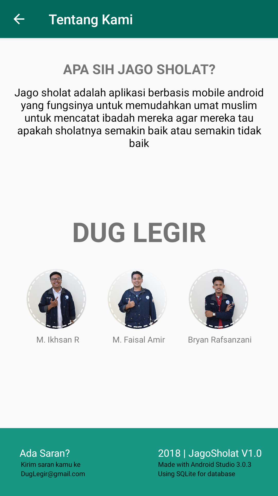

## Jago Sholat
Jago Sholat, Aplikasi pencatatan shalat
- Play Store [Click Here](https://play.google.com/store/apps/details?id=org.d3ifcool.jagosholat)
- All Document [Click Here](https://github.com/amirisback/jago-sholat/tree/master/docs/document)

## Description
Jago Sholat adalah aplikasi berbasis android yang di khususkan untuk pencatatan sholat. Di dalam aplikasi terdapat fitur-fitur yang dapat membantu anda dalam melaksanakan ibadah, seperti misalkan fitur pencatatan ibadah , lalu fitur jadwal ibadah berdasarkan tempat masing-masing, lalu terdapat fitur statistik ibadah yang merupakan hasil dari pencatatan ibadah, lalu ada fitur kompas yang membantu anda dalam melihat arah qiblat dari daerah anda dengan bantuan dari GPS, lalu terdapat fitur tata cara, yang mana didalamnya tersebut terdapat fitur lagi yaitu tata cara sholat yang membantu anda dalam mengetahui gerakan sholat sesuai dengan sunnah nabi, lalu tata cara wudhu, doa-doa sholat, dan juga niat sholat.

## Feature
- Pencacatan Ibadah Shalat
- Tampilan Jadwal Shalat
- Grafik Pencatatan Ibadah
- Arah Kiblat
- Tata Cara

## Screen Shoot

| UI 1 | UI 2 | UI 3 |
|:----:|:----:|:----:|
| |  |  |

| UI 4 | UI 5 | UI 6 |
|:----:|:----:|:----:|
| |  |  |

| UI 7 | UI 8 | UI 9 |
|:----:|:----:|:----:|
| |  |  |

## Version Release
This Is Latest Release

    $version_release = 1.0.0

## Colaborator
Very open to anyone, I'll write your name under this, please contribute by sending an email to me

- Mail To faisalamircs@gmail.com
- Subject : Github _ [Github-Username-Account] _ [Language] _ [Repository-Name]
- Example : Github_amirisback_kotlin_admob-helper-implementation

Name Of Contribute
- Muhammad Faisal Amir
- [Muhamad Ikhsan Ramadhan](https://github.com/ikhsanramadhaan)
- [Bryan Rafsanzani](https://github.com/bryanrafsanzani)

<!-- ALL-CONTRIBUTORS-LIST:START - Do not remove or modify this section -->
<!-- prettier-ignore-start -->
<!-- markdownlint-disable -->

<table>
    <tr>
    <td align="center"><a href="https://github.com/bryanrafsanzani"> <b>Bryan Rafsanzani</b></td>
    <td align="center"><a href="https://github.com/amirisback"> <b>Muhammad Faisal Amir</b></td>
    <td align="center"><a href="https://github.com/ikhsanramadhaan"> <b>Muhamad Ikhsan Ramadhan</b></td>
    </tr>
</table>
Waiting for your contribute

## Attention !!!
- Please enjoy and don't forget fork and give a star
- Don't Forget Follow My Github Account

